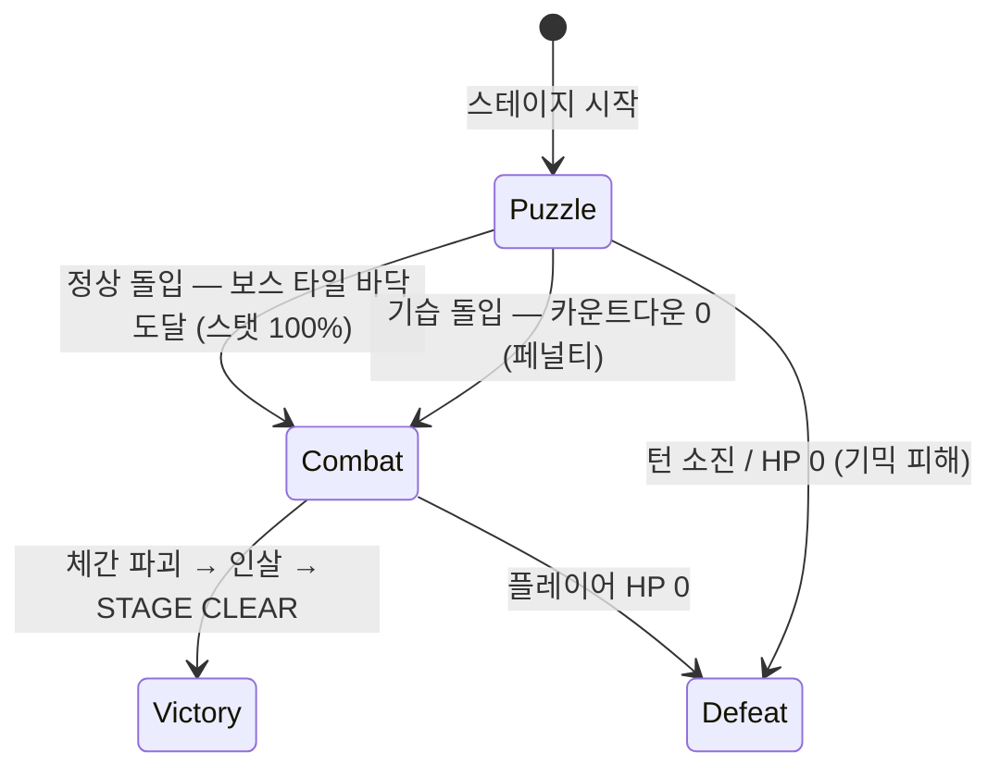

# ChainRiposte — 게임 기획서 (GDD)

> 원본 컨셉: [PROJECTPLAN.md](PROJECTPLAN.md) · 이 문서는 구현 기준이 되는 정리본이며, 수치는 전부 **프로토타입 기본값**(ScriptableObject로 노출되어 인스펙터에서 조절 가능)이다.

## 1. 개요

- **장르**: 다크 판타지 3매치 퍼즐 + 1:1 타이밍 액션(패링)
- **플랫폼/뷰**: 모바일 세로형 (프로토타입은 PC에서 마우스/키보드로 조작, 해상도 1080×1920 기준)
- **핵심 루프**: 퍼즐로 빌드업(파밍) → 보스 난입 → 패링 전투로 클라이맥스
- **개발 환경**: Unity 6 (URP 2D) / 데이터 주도(Data-Driven) 아키텍처

## 2. 게임 플로우

**코어 루프 — '단 하나의 클라이맥스'**: 한 스테이지 = 퍼즐 페이즈 1회 + 전투 페이즈 1회.

1. **파밍과 텐션 빌드업**: 몬스터 타일을 매치하며 쾌적하게 스탯을 쌓는다. 점수가 오를수록 보스 타일 스폰 확률이 폭주한다.
2. **다중 시한폭탄의 압박**: 보드에 보스 타일이 2~3개 쌓이고, 각각 독립 카운트다운이 돈다. 타이머가 늘어난다는 것은 보스가 늘어나는 게 아니라 **기습당할 위협이 늘어난다**는 뜻.
3. **전투 돌입과 결착**: 어느 쪽 돌입이든 2버튼 패링 전투 → 인살로 클리어 → 다음 스테이지(더 어려운 맵/기믹).

퍼즐에서 쌓은 스탯은 그대로 전투로 이월된다.

## 3. 퍼즐 시스템

### 3.1 보드

- **N×M 2차원 그리드 + 마스킹**: 각 셀은 Active/Inactive. Inactive 셀에는 타일이 스폰되지도, 낙하하지도 않는다 → 하트/해골/십자가 등 비정형 보드 가능.
- 프로토타입 기본 크기: **7(가로) × 9(세로)** — 세로형 화면 비율에 맞춤.
- 보드 형태·스폰 확률·턴 제한 등은 전부 `StageData` SO에 정의 (기획자가 코드 수정 없이 편집).

### 3.2 타일 종류

| 분류 | 타일 | 동작 |
|---|---|---|
| 일반 몬스터 | 해골, 부패한 쥐, 슬라임, 박쥐, 구울 (5종) | 3개 이상 매치 시 처치 → 영혼석 드랍 |
| 특수 | 물약 | 매치 시 HP 즉시 회복 — 시한폭탄 등 기믹 피해로 퍼즐 중에도 HP가 깎일 수 있으므로 생존 수단이 된다 |
| 기믹 | 벽(장애물) | 스왑/낙하 불가. 인접 매치로 내구도(HP)를 깎아 파괴 |
| 난입 | 보스 타일 | §5 참조 |

### 3.3 매칭 규칙

- 인접(상하좌우) 타일 스왑. 매치가 발생하지 않는 스왑은 롤백되며 **턴을 소모하지 않는다**.
- 가로/세로 3개 이상 동일 타일 = 매치. 매치된 타일 파괴 → 중력 낙하 → 상단 리필 → 연쇄(캐스케이드) 반복.
- **낙하 규칙**: 타일은 비활성(구멍) 셀을 통과해 직선 낙하하고, 벽은 고정되어 낙하를 막는다. **벽 때문에 위에서 채울 수 없는 칸은 대각선 위 타일이 미끄러져 들어와(Diagonal Fall)** 보드에 영구 빈칸이 생기지 않는다.
- **콤보**: 한 번의 스왑에서 연쇄가 이어질 때마다 콤보 카운트 +1.

### 3.4 영혼석(경험치) 파밍

- 획득량 = `타일 기본 영혼석 × 콤보 배수` (콤보 배수 = 1 + 0.5 × (콤보-1), 기본값).
- **점수(Score) = 누적 획득 영혼석**. 스탯 누적량과 등가이며, 보스 타일 스폰 확률 곡선(§4)의 입력이 된다.
- 경험치 바가 가득 차면 **레벨업 → 스탯 포인트 1 적립**. 포인트는 즉시 또는 나중에 분배 가능(적립식).
- 레벨업 요구량: `30 + 15 × (현재레벨 − 1)` (기본값).

### 3.5 스탯 (전투 대비 빌드업)

| 스탯 | 효과 | 기본값 / 성장 | 제한 |
|---|---|---|---|
| 공격력 (ATK) | 보스 공격 시 HP·체간 피해 증가 | 10 + 3/lv | 없음 |
| 방어력 (DEF) | 피격 시 받는 피해 감소 | 0 + 2/lv | 없음 |
| 판정치 (Parry) | 패링 성공 윈도우(초) 증가 | 0.15s + 0.03s/lv | **하드 캡 5레벨** (최대 0.30s) — 하드코어한 긴장감 유지 |

### 3.6 스테이지 기믹 (확장 구현 사항)

퍼즐 페이즈의 난이도 장치. 목적은 두 가지 — **① 보스전 도달 전에 사망할 수 있는 위협**, **② 파밍을 방해해 스탯이 부족한 채로 보스전에 가게 만드는 압박**. 후반 스테이지로 갈수록 기믹이 추가되어 난이도가 상승한다.

- **on/off 방식**: 각 기믹은 독립 모듈이며, `StageData`의 기믹 목록에 넣으면 해당 스테이지에서 활성화된다 (FSM이 아닌 조합형 — 한 스테이지에 여러 기믹 동시 적용 가능).
- 구현 우선순위는 코어 루프(퍼즐+전투) 완성 이후. 단, 턴 이벤트/HP 시스템 등 연결점은 코어 설계에 선반영한다.

| 기믹 | 룰 | 압박 효과 | 해제법 |
|---|---|---|---|
| **전염되는 타일** (The Spreading Corruption) | '부패한 늪/살덩이' 타일 1~2개로 시작. 턴 소모 시 그 주변에서 매칭이 터지지 않으면 인접 몬스터 타일 1개를 무작위 감염 | 방치하면 보드 전체가 덮여 매칭 공간 소멸(데드락). 파밍보다 방역이 급해지는 공간 압박 | 부패 타일 인접 매칭으로 확산 저지/제거 |
| **시한폭탄 몬스터** (Ticking Death) | 낙하하는 일반 몬스터 일부에 붉은 턴 카운트(예: 3턴)가 붙어 스폰 | 카운트 내 처치 실패 시 폭발 → **플레이어 HP 직접 피해**. 물약 타일을 퍼즐 중에도 필사적으로 맞출 명분 제공 | 카운트 내 3매치로 처치 |
| **사슬 결박** (Locked Tiles) | 몬스터 타일에 녹슨 쇠사슬이 감겨 스폰. 스왑·중력 낙하 불가로 그 자리에 고정 | 유저 동선 강제, 보드 유동성 저하 | 결박 타일을 포함한 3매치 또는 인접 매칭으로 사슬 파괴 |

> '벽'과 '사슬 결박'의 차이: 벽은 매칭 자체가 불가능한 고정 장애물, 결박은 **일반 타일에 걸린 디버프**(해제 시 정상 타일로 복귀).

## 4. 보스 난입 — 동적 가중치 스포너 & 확률 폭주

맵 상단에서 떨어지는 타일 구성은 **현재 점수(누적 영혼석)와 경과 시간**에 비례해 극단적으로 변한다.

### 4.1 페이즈별 스폰 확률

| 스포너 페이즈 | 진입 조건 (기본값) | 보스 타일 스폰 확률 | 연출 |
|---|---|---|---|
| 1. 고요 | 스테이지 시작 | **0%** — 안전 파밍 구간 | 앰비언트 |
| 2. 강림 | 점수 임계점(100) 돌파 **또는** 45초 경과 | **5%** — 첫 보스 타일 낙하, 듀얼 카운트다운 가동 | 무거운 쇳소리 |
| 3. 심연 | 점수 상승에 비례 | 10% → 20% → 30% … **상한 없이 상승** | 디스토션 노이즈 크레센도 |

- 파밍 욕심을 내어 점수를 올릴수록 보스 타일이 비 오듯 쏟아진다 — 리스크/리턴의 핵심.
- **구현**: if 분기 대신 **`AnimationCurve`** 2개(x=점수, x=경과 시간 → y=스폰 확률, 두 값 중 최댓값 적용)를 `StageData`에 노출. 기획자가 인스펙터에서 그래프를 드래그해 난이도 곡선을 조절한다.

### 4.2 멀티 카운트다운 텐션 (The Multi-Threat)

- 보드 위 **각 보스 타일은 독립적인 듀얼 카운트다운(실시간 초 + 잔여 턴)** 을 가진다. 어느 쪽이든 먼저 0이 되면 발동.
- 보스 타일이 3개면 타이머가 3개 — 보스 3마리가 아니라 **기습 위협이 3중**이라는 뜻. 전투는 항상 1:1.
- 유저는 가장 촉박한 타일을 파악해 그쪽부터 처리해야 한다.

### 4.3 전투 돌입 방식

| 돌입 | 조건 | 결과 |
|---|---|---|
| **정상 돌입** | 카운트다운이 끝나기 전에 보스 타일 주변 블록을 부숴 **해당 열 최하단 Active 셀(바닥)까지 낙하**시킴 | 파밍 스탯 100% 적용, 정상 보스전 |
| **기습 돌입 (Ambush)** | 보스 타일 중 **하나라도** 카운트다운 0 도달 | 페널티(기본값: 시작 HP 50%)를 안고 강제 전투 |

- 보스 타일은 일반 타일처럼 낙하하되 매치 대상은 아니다.
- 전투 돌입 즉시 퍼즐은 종료되고 잔여 보스 타일은 소멸한다 (클라이맥스는 스테이지당 1회).

## 5. 전투 시스템 (2버튼 하드코어 액션)

### 5.1 조작

이동 없음. 화면 하단 좌우 2버튼(프로토타입: 키보드 ←/→ 또는 마우스 버튼).

- **좌: 패링 (Parry)** — 탭 순간부터 `판정치` 초 동안 패링 판정 활성.
- **우: 공격 (Attack)** — 커밋 시간 존재. **공격 모션 중에는 패링 불가** (리스크/리턴).

### 5.2 공방 메커니즘 (세키로 룰)

- **보스 패턴**: `BossData` SO에 공격 시퀀스 정의. 각 공격 = (텔레그래프 시간, 타격 시점, 피해량, 패링 가능 여부). 정박/엇박 리듬을 데이터로 설계.
- **패링 성공**: 보스 공격이 패링 윈도우 안에 들어오면 피해 0 + 보스 **체간(Posture) 대폭 상승** + 이펙트/사운드 훅.
- **패링 실패/미입력**: `보스 피해량 − DEF` 만큼 HP 감소.
- **공격**: ATK 기반으로 보스 HP와 체간을 소폭 깎는다. 보스 HP가 낮을수록 체간 회복 속도 감소(후순위 옵션).
- **인살(처형)**: 체간 게이지가 한계치 도달 → 화면에 붉은 인살 마크 → 공격 버튼 입력 시 피니시 연출 + 스테이지 클리어.

## 6. 데이터 주도 설계 (ScriptableObject 목록)

| SO | 내용 |
|---|---|
| `StageData` | 보드 마스킹, 턴 제한, 목표 점수, 타일 스폰 가중치, 벽 배치/내구도, 난입 보스 참조, **스폰 확률 AnimationCurve(점수/시간 2종)**, 보스 타일 카운트다운(초/턴), 기습 페널티, **활성 기믹 목록(§3.6 on/off)** |
| `TileData` | 타일 종류, 기본 영혼석, 스프라이트(추후 에셋) |
| `PlayerStatsConfig` | §3.5의 모든 성장 수치, 판정치 하드 캡 |
| `BossData` | 보스 HP/체간 한계치, 공격 패턴 시퀀스 |

## 7. 아트/오디오 (에셋 단계에서 적용 — 훅만 준비)

- 저채도 다크 판타지 톤, 필름 그레인 + 비네팅, 고해상도 픽셀 아트.
- 퍼즐: 앰비언트 / 난입 임박: 디스토션 노이즈 크레센도 / 전투: 록 밴드 인스트루멘탈, 패링 시 쇳소리+기타 피드백.
- 프로토타입은 단색 스프라이트/도형 플레이스홀더 사용. 모든 연출은 이벤트 훅으로 분리해 에셋 교체만으로 완성되게 한다.

## 8. 확정된 결정 및 남은 가정 사항

**확정 (2026-07-14)**
- 성장 모델: 영혼석 적립 → 레벨업 → 스탯 선택 분배 (타일 직결형 아님). 타일은 전부 몬스터.
- 점수 = 누적 획득 영혼석. 스폰 확률 곡선의 입력.
- 보스 난입: 동적 가중치 스포너(고요→강림→심연) + 보스 타일별 독립 듀얼 카운트다운 + 정상/기습 돌입.
- 스테이지 기믹 3종(전염/시한폭탄/결박)은 확장 구현 사항. `StageData` 기믹 목록으로 스테이지별 on/off (조합형 모듈).
- 플레이어 HP는 퍼즐 페이즈에서도 기믹으로 감소 가능 → 물약 = 퍼즐 중 즉시 HP 회복 (원안 유지).

## 9. 스테이지 선택 — 월드맵 (2026-07-15 확정)

뉴 슈퍼 마리오 브라더스식 월드맵. 캐릭터가 맵 위를 이동하며 스테이지를 고른다.

### 9.1 구성

- **스테이지**: 1-1, 1-2, 1-3, 2-1, 2-2, 2-3 (총 6개, 경로로 연결).
- **월드 2 차별화**: 배경이 다르고 보스가 다르다 (퍼즐/전투 방식은 동일). 추후 월드 2 스테이지에 기믹형 타일(§3.6) 추가.
- **조작**: 스테이지 노드를 클릭 → 캐릭터가 경로를 따라 자동 이동 → 도착하면 남는 공간에 스테이지 정보 패널(보드 크기, 턴 제한, 보스, 월드) + START 버튼.
- START → 선택된 StageData를 들고 Main 씬 로드. 결과 화면에서 MAP 버튼으로 복귀.

### 9.2 추후 구현 (백로그)

- **진행도 잠금/세이브**: 클리어한 스테이지까지만 이동 가능 + 진행 상황 저장.
- **월드 2 콘텐츠**: 전용 배경 아트, 전용 보스(BossData), 기믹 타일 조합.

### 9.3 모바일 뷰 대응 (추후 — 출시 요구사항)

핸드폰 출시 예정이므로 **세로(Portrait) 뷰를 제공**해야 한다.

- 월드맵/퍼즐/전투 모든 화면이 세로·가로 양쪽에서 성립해야 하며, **UI 요소 위치를 방향별로 변경 가능**한 구조로 만든다 (앵커 프리셋 or 방향별 레이아웃 데이터).
- 현재 프로토타입 UI는 1080×1920 세로 기준 CanvasScaler로 조립되어 있음 — 방향 전환 시 재배치 규칙(예: 전투 2버튼은 세로=하단 좌우, 가로=양쪽 사이드)을 에셋 단계 전에 정의할 것.

**가정 (기본값, 인스펙터에서 조절 가능)**
- 보드 7×9, 몬스터 타일 5종.
- 강림 페이즈 진입: 점수 100 또는 45초 경과.
- 보스 타일 카운트다운: 20초 / 8턴 (먼저 0이 되는 쪽 발동).
- 기습 페널티: 시작 HP 50%.
- 전투 돌입 시 잔여 보스 타일 소멸.
- "턴 소진 시 패배"로 가정.
- 시한폭탄 몬스터 기본 카운트: 3턴, 폭발 피해 기본값 미정(기믹 config로 노출 예정).
